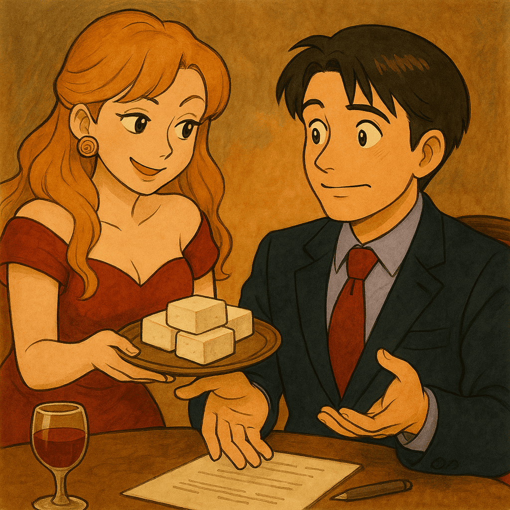

# Day 11  客人總是想佔你便宜上下其手？

> 原文連結: https://ithelp.ithome.com.tw/articles/10378968

  
(AI因為政策關係，沒辦法做出被騷擾的情境，只能讓她端碗豆腐

> 客人不斷丟需求的時候，最需要的不是火氣，而是耐心與技巧。

### 為什麼不能直接拒絕？

當客人不停地提出各種需求時，牛郎工程師絕不能直接拒絕或顯露不耐煩的態度。相反地，你需要耐心聆聽、展現同理心，然後巧妙地慢慢引導客人回到合理範圍。

如果你直接回一句「不行」，對方只會覺得：

* 你不夠用心
* 你不願意配合
* 甚至懷疑你專業不足  
  所以重點不是「能不能做」，而是「怎麼說、怎麼引導」。

### 建議的處理方式

1. 耐心聆聽
   * 先讓客人把所有想法說完，避免立即反駁。
   * 這能降低對方的防備心。
2. 系統整理
   * 將需求整理成「優化建議清單」，標註：
   * 優先順序
   * 可行性
   * 對專案的影響
3. 委婉引導
   * 建議客人先聚焦於最重要或影響最大的需求。
   * 讓客人逐步理解並接受專案的資源與時間限制。

### 範例

-「您的需求我都詳細記錄下來了，目前我們先聚焦於這些影響較大的項目，其他項目我們規劃至下一階段進行優化，這樣安排您覺得如何？」  
-「這些想法都很棒，但考量目前專案進度，我建議我們先處理核心功能，其餘的需求我會先放在後續的優化清單裡，隨時再跟您更新進度。」

### 善用三明治溝通法

溝通時，避免正面硬碰硬，可以用「三明治」的方式：

0. 先肯定 → 「這些想法很棒」
1. 再限制 → 「目前時間有限」
2. 最後給方案 → 「其他需求我們排進優化清單」

這樣能：

* 拉長討論空間
* 避免緊張氣氛
* 讓客人覺得自己「有被聽到」

> 透過這樣的耐心引導，你不僅能有效管理客人的期望，更能提供情緒上的尊重與理解，使客人感受到被重視，避免專案失控。

~~當然啦，有時候即便你想買紅油漆、冥紙灑在他的辦公座位上，及擺兩桶汽油，開會時在他面前玩打火機也是不可以的～~~