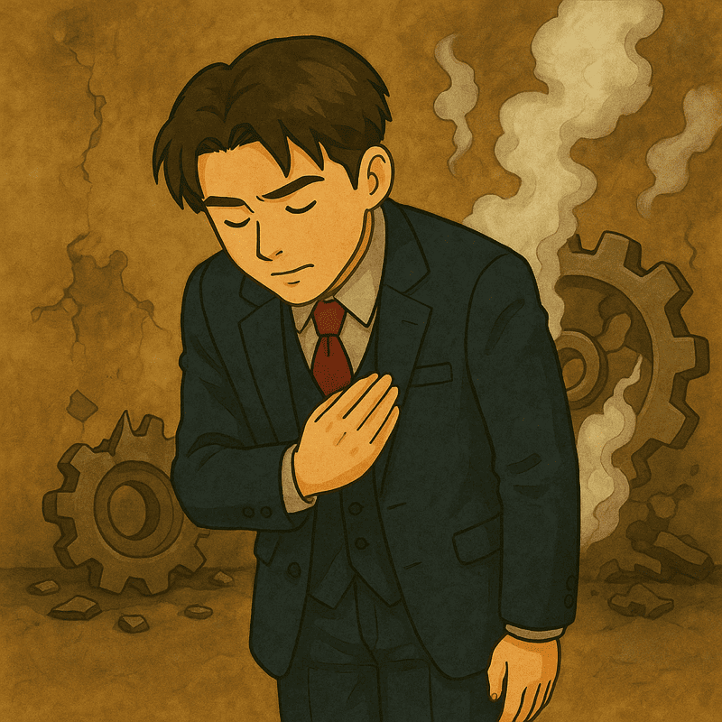

# Day 18  牛郎工程師的公關危機

> 原文連結: https://ithelp.ithome.com.tw/articles/10382412

> 再完美的牛郎工程師，也難免會遇到專案出包的時候。

出包本身不可怕，可怕的是在危機時失去信任。這時候比技術更重要的，其實是你的態度與回應方式。因為客人未必懂技術，但一定能感受到你的姿態與誠意。

#### 先承認錯誤，不閃躲、不甩鍋

* 第一時間承認，是穩住關係的關鍵。
* 千萬不要拐彎抹角、或急著推卸，否則會被認定「不負責」。
* 一句簡單的：「這次確實是我們這邊疏忽，我很抱歉。」
* 就能讓客人放下戒心，願意進入「怎麼解決」的下一階段。

承認錯誤，不代表你要背所有鍋，而是展現你願意先負責的態度。

#### 立即修正行動，不畫大餅

* 道歉之後，立刻提出具體行動計劃。
* 例如：「我們預計今晚 10 點前完成修正，並在 11 點前提供更新報告。」
* 客人最怕的不是 bug，而是聽到一句：「我們會再討論一下。」

危機當下，沒有什麼比「確定的行動」更能帶來安心。

#### 保留客人面子，讓對方台階下

* 就算問題有一半責任在客人，也別急著戳破。
* 可以用：「我們那時可能沒解釋清楚。」來模糊焦點。
* 這樣一來，對方在內部轉述時，也能保住專業體面。

對方能下台，你們的關係才能上得去。

#### 定時回報進度，創造安心節奏

* 危機中，別等對方追問才更新。
* 每 2～3 小時主動簡短回報一次：「目前已完成 A，正在處理 B，預計幾點完成 C。」
* 即便問題還沒完全解決，對方也會因為「有節奏感」而覺得你可靠。

危機處理不是「一口氣解決」，而是「讓人一路安心到解決」。

### 總結

危機處理不是單純的滅火，而是 信任的修補工程

* 承認錯誤
* 立即行動
* 保留面子
* 定時回報

你不只救回專案，更能在關鍵時刻加分自己的職場信用分數。牛郎工程師靠的不是閃避，而是勇於面對、懂得說話的技術，尤其是那些喜歡「享受屬下報告」的客人，最吃這一味。

### 職場延伸

客人吃的其實是「情緒回報」，有些客人（尤其主管型），其實並不在乎細節修正過程，他們真正想要的是

* 「有人在幫我盯」
* 「我不需要被老闆追殺」
* 「我能交差」

即使修正進度只有 20%，但因為你在持續更新，他們就覺得：「這個人值得信賴」。