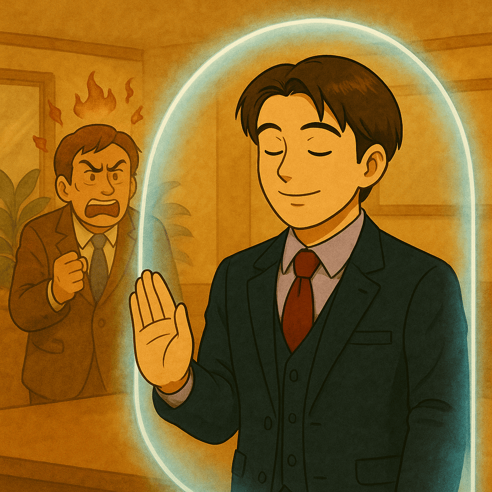

# Day 20  牛郎工程師的自我情緒管理

> 原文連結: https://ithelp.ithome.com.tw/articles/10384037

> 情緒價值不代表情緒綁架。成熟的牛郎懂得溫柔，也懂得保護自己。

### 牛郎工程師也是人：壓力管理與自我修復

牛郎工程師不是機器，更不是情緒垃圾桶。你可以對客人貼心、熱情服務，但這不代表要把每一個客人的焦慮、憤怒、急躁都往自己心裡裝。

很多工程師在專案過程中，會因為客人語氣不佳或壓力過大，而不自覺地陷入自責或內耗：

* 「**是不是我做不好？**」
* 「**是不是我又搞砸了？**」

但請記住：客人的情緒，不等於你的責任。

### 為什麼要建立「情緒防火牆」？

有時候，客人的不耐煩並不是針對你：

* 他可能是剛被老闆罵完，轉頭就把情緒帶到會議裡。
* 他的急躁，來自其他部門的 bug，而不是你這邊的延誤。
* 他甚至只是在找一個出口，把壓力轉嫁出去。

如果你沒有建立「**情緒防火牆**」，這些外部情緒就會變成你內心的小聲音，開始懷疑自己、磨損專業自信，長期下來會導致倦怠。牛郎工程師的修煉之一，就是理解情緒，但不必接收情緒。你可以同理對方的焦慮，但不要讓它轉化成對自己的攻擊。

### 幾個實用做法

* 先回到呼吸
  + 當你感覺心跳加快、手心冒汗，別立刻回訊息。先深呼吸幾次，讓身體放鬆，再做回覆。
* 拉高視角
  + 問自己：「如果我是客人，會怎麼看這件事？」
  + 這能幫助你從「被罵的人」切換成「處理問題的人」，心態立刻不同。
* 下班就斷電
  + 班後別再反覆重播對話紀錄，也不要帶著會議的爭執回家。
  + 給自己一個心理儀式，例如運動、散步或泡澡，讓大腦切換模式。
* 設定心理界線
  + 明確區分「**客人的需求**」和「**客人的情緒**」。需求是你要處理的事，情緒不是。

### 長期效果

如果你能做到「**同理但不背負**」，不僅能減少內耗，還能讓你：

* 保持專業穩定的形象，不被情緒左右。
* 在長期專案中維持體力與心力，不會因為過度共感而燃燒殆盡。
* 更有餘裕去提供真正的情緒價值，因為你已經先照顧好自己。

### 職場延伸

* 內耗時適當轉換情緒是很重要的，在工作時也是一樣，遇到不滿的事情最好適時說出來與朋友抒發（但不要把對方當情緒垃圾桶）。
* 像是筆者目前也在試著學習**課題分離（Task Separation）**，對人生非常有幫助，各位也可以試試。
* 千萬不要陷入情緒的旋渦中。
* ~~不要像筆者在工作時，跟客人開完會後會再跟同事們會後複盤時說：「台語（他知不知道他剛剛在問什麼？幹Ｘ娘目洨因仔、撿角，30多歲了什麼都不知道沒技術沒管理，還想學人做Tech Lead，到底來幹嘛的）☺️」~~