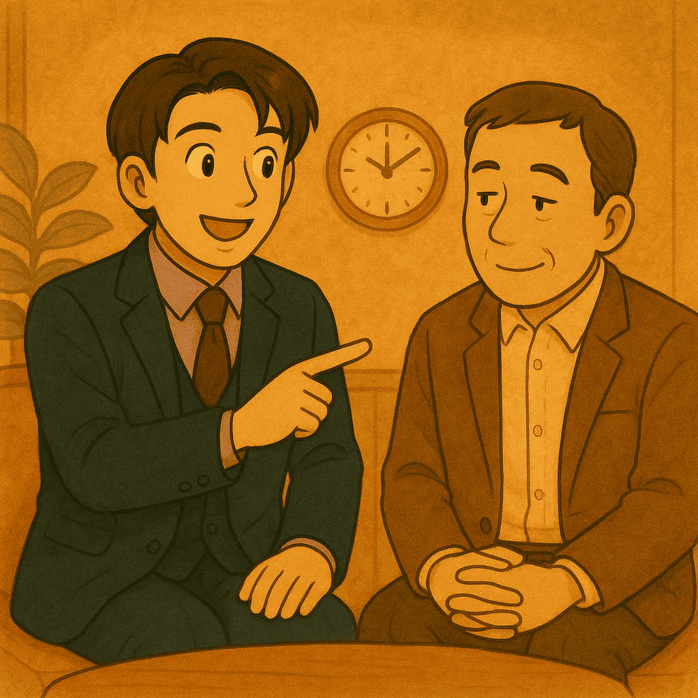

# Day 22  客人面對專案冷處理怎麼辦？

> 原文連結: https://ithelp.ithome.com.tw/articles/10385216

> 為什麼會出現冷處理？

牛郎工程師難免會遇到客人突然冷淡、訊息不回、進度停滯的情況。這時候，不要急著解讀成「客人不滿意」或「專案要砸鍋了」。  
其實，很多冷處理來自客人內部的狀況：

* 他可能卡在內部決策流程，無法給你明確答覆。
* 他可能卡在預算或資源，需要等待批示。
* 他也可能只是人生壓力太大，暫時沒心力處理。

這些情境都和你無關，卻會影響專案的推進。這時候，不是硬推進，而是要學會「輕輕推進、不能催促、適度留白」。

### 三大原則

* 輕輕推進：用關心與提醒的方式維持存在感，讓對方知道你還在。
  + 「最近有點忙嗎？這邊都還準備好隨時支援。」
  + 「上週提到的修改我已經完成，等你有空我們再一起確認。」
* 不能催促：避免造成壓力，因為對方本來就卡住，催促只會讓他更抗拒。
  + 「不用急，等你方便再繼續就好。」
  + 「我會先保留時間，隨時配合你們的進度。」
* 適度留白：有時候沉默就是一種空間，讓對方回來時不會感覺有壓力。
  + 「這案子我還是很有熱情，如果之後想繼續，就再叫我一聲就好！」
  + 「等你覺得時機合適，我這邊都能再啟動。」

### 反面示範

反面案例往往發生在工程師急著「要答案」的時候：

* 工程師 A：「你怎麼還不回？這功能要不要繼續？」
* 工程師 B：「這週不確定？那下週一定要給我答覆，不然會 delay。」

問題在於：

* 把自己的焦慮丟給客人，導致雙方關係更緊張。
* 客人如果原本就不方便，這樣的催促只會加重反感。
* 結果可能變成「已讀不回」，專案進一步降溫。

相較之下，耐心等待、搭配輕輕提醒，會讓客人回頭時感受到「沒有壓力」的好感。

### 進退拿捏的技巧

* 保持低頻但穩定的存在感
  + 一兩週一次的輕微提醒就好，避免天天追問。
* 用「我」而不是「你」
  + 說「我這邊準備好」比「你怎麼還沒決定」更柔和。
* 預留彈性話術
  + 加上「沒關係」、「等你方便」這些緩衝字眼，讓客人感受到尊重。
* 設定心理界線
  + 不是所有專案都能馬上推進，有時候冷處理就是市場訊號，要懂得分辨「還有機會」和「差不多該收尾」。

### 長期效果

當你能妥善處理「冷處理」階段，你會發現：

* 客人回頭時更容易接續合作，因為沒有心理負擔。
* 你在對方心中被標記為「不會給壓力的人」，因此更容易被優先找上。
* 即使專案暫停，你的形象依舊正面，不會因急躁而失去信任。

### 職場延伸

冷處理不只會發生在客戶身上，也會出現在：

* 內部跨部門合作：有些同事手上太多事，導致溝通停滯。
* 主管決策：上層還在拉鋸時，進度自然無法推動。

這時候一樣要用「輕推進 + 留白」的手法，因為你不是要逼出答案，而是要創造「有你在，專案隨時能動起來」的印象。