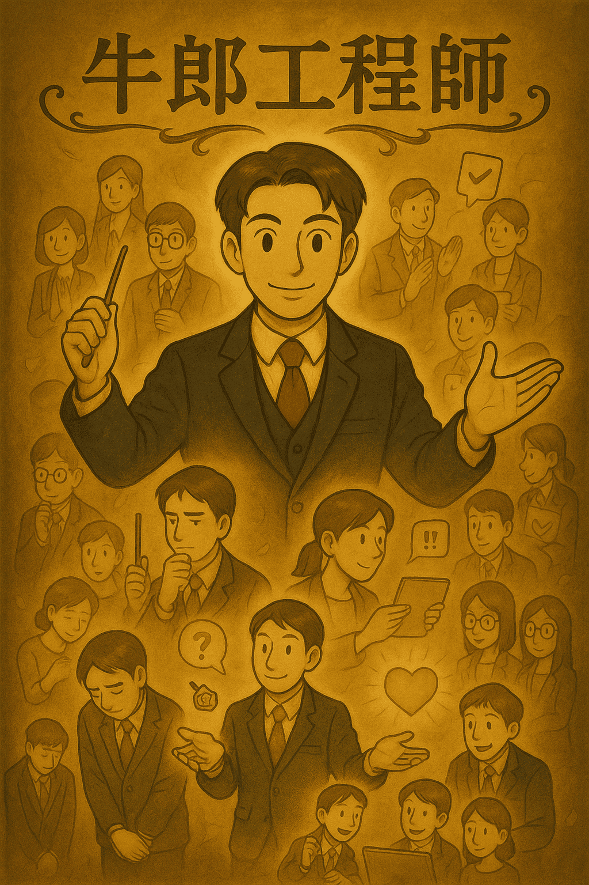
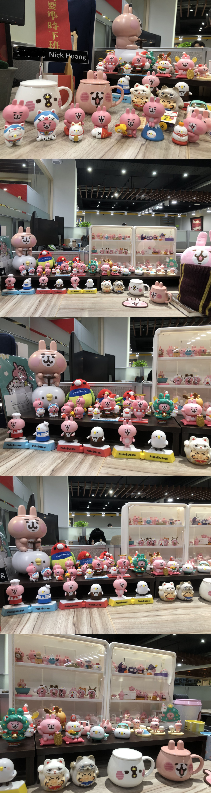

# Day 30  最終總結：牛郎工程師的真正交付

> 原文連結: https://ithelp.ithome.com.tw/articles/10391021

#### 「交付功能」只是個開始

#### 「交付情緒」你就是高手

#### 「交付信任」這才是最高境界

30 天前，我們從一個看似荒謬的比喻開始：工程師，怎麼可能像**牛郎**？

但隨著每一天的展開，你可能慢慢理解到「牛郎工程師」不是在取悅，而是在看懂人、理解人，進而引導人。  
我們寫的是**職場情商的戰鬥筆記**，更是**信任養成的完整方法論**。

### 這系列寫完了，但你的養成才正要開始

30 天的牛郎工程師修練結束了。  
但情緒價值，是每天都要更新的實戰功夫。  
你會遇到不同的客人，不同的合作對象，不同的難搞情境。

但只要記得這些話就夠了：

* 不只是把事情做完，而是讓對方因為你而感覺被照顧、被理解、被支持。
* 這不是工具人的使命，而是成為團隊最被信任的存在。
* 還有遇到想**白瞟的客人**就趕緊跑吧，吃飯都知道要付錢啊。

---

### 賽後感言

Ya~ 終於完賽了，第一次參賽真的是捏把冷汗，每天起床第一件事就是寫文章，還要花時間產封面圖。  
牛郎工程師的概念最早是我的同事邀請我參加鐵人賽團賽時想到的。那時受到邀請後還沒想到要做什麼，結果坐公車坐到一半像是被雷打中一樣，牛郎工程師的一些想法就在那時浮現出來，加上在工作上遇到許多事情後，發現其實很多理論是可以被實踐的，於是花了一個晚上編寫了一個大綱列表出來。我還特地上網找過一輪，好像真的沒有人創過這個**牛郎工程師**名詞，所以我算是搶得頭香第一人～（應該吧？

之前在網路上看過一個網友發過一篇文：「公司就是青樓，我們各位要做的就是盡快從青樓贖身，而不是在裡面爭做頭牌。」僅僅幾句話，又看了一些公司的所作所為後，覺得說得非常好。

有時工作時最難過不僅僅是遇到難搞的猴子還有整個公司體制的問題，但更讓人難過的是其他更資深的同事跟你說其實大部分公司都是這樣。

---

接著說說一些我的事好了，之前在工作上有兩個選擇：

* 一個是更自由而且可以領更好的香蕉。
* 一個是公司非常大而且有自己的產品，然後給香蕉皮。

兩者之間我選擇了後者，因為我想跟著團隊一起做產品，但殊不知進去後發現好像沒有幾個人真的想做產品。雖然工作上弄的滿頭灰，但也認識一些很好的同事一同工作。（現在沒有了學乖了香蕉最讚了）

從中也學到很多非技術的事情像是

* 工作上架空某些人。
* 控制訊息對外的傳遞。
* 不需要什麼事都說出來。
* 猴子遇到問題被問倒時，就拋出更大議題逼他認同，快速結束話題（這招真的很好用）。
* 還有同事情緒上出現問題時，適當幫忙排除。
* 偶爾串個場當部門和事佬
* 某個專案進度又被卡住了，猴子也不願意了解或是幫忙疏通，我就試著擺爛順著延了半年也沒事。
* 送甜點真的有助於團隊士氣跟趨緩高壓的工作氛圍，沒有要做什麼受賄只是想讓團隊快樂，但這個取決於牛郎們的口袋有多深，別硬花錢。
* 適當關心其他部門的狀況
* 還有很多不能說的事情 X)

當然文章寫得很理想，現實的我當然偶爾也會像野狗一樣開會瞪著猴子大概十次有五六次不敢抬頭看人，因為他好像也不知道他在問什麼，所以我也不是個很標準的牛郎工程師。

以前常加班的後果也讓我有有點幻聽、自律神經失調，以及睡覺睡到一半會盜汗被嚇醒或顫抖，問了很多醫生應該是恐慌症發作，當然現在除了自律神經還是壞的外，其他都已經好多了。

以及我對於經歷這些事情後的感悟就是「**一切都是不重要的**」。  
專案進度、產品上不上線什麼的，無論你再努力，只要主管層無心在專案只想辦公室政治搶奪資源戰爭，其實沒有什麼是重要的，只有永無止盡的專案延期。  
那你可能會想這麼亂更上面會看不到嗎？其實也不重要，大不了就裁員或永無止盡Reorg整合，猴子們只要在每次的風波下躲好就不會有事了。所以演變成上面也看不到問題，一直裁基層一直重組，後面養了一堆猴子在裡面自己都不知道。

以前網路上鬼故事聽多了也是笑笑，真的砸在自己頭上時真的會哭喔。那你說這些真的都是不對的嗎？也不一定，蟑螂都有生存權利了，多的就只是要利益衝突吧了。

工作上真正重要的是**職場心理健康**，所以要適當的去轉換心態你的日子才會過的好過得長久，早早下班去追劇、運動、跟朋友聚一聚也好，享受些生活。把真正的熱情逐步由職場改放在生活上。

現在世道太亂了，你該小心的不是不小心把事辦砸了，而是有多少人想坑你。

#### 最後 Shout-out to my team

* 🧗 Vincent（逆齡攀岩魔人）— Senior Frontend Developer
  + 他的基礎代謝率高到像是巨人一樣，能量消耗永遠比常人多好幾倍。曾經半夜餓到受不了，直接把隔天的便當當宵夜解決，還能若無其事地繼續上班。不管是熬夜還是攀岩運動，他總能保持旺盛的體力，就像體內有某種神秘的能量核心，持續供應燃料。在攀岩場上，他更是逆齡般的存在，每一步踩點、每一次爆發力，都讓人懷疑他到底是不是偷偷多活了一條命，另外前端領域已經達到爐火純青的地步了。
* 🐶 Pink（開會用鎮暴型比特犬）— Mid Fronted Developer
  + 開會時，她就是場上的壓制力量，眼神一掃，空氣都會凝固。只要有人敢問笨問題，後果自負，那股威壓足以讓全場閉嘴。年少輕狂，敢做敢衝，沒有人能預測下一秒會發生什麼。她的能量像一顆隨時待命的閃光彈，能瞬間讓整場會議轉為正軌。
* 😊 Claudia（微笑蔡依玲）— Mid Full stack developer
  + 面對鳥事，她笑；遇到冷笑話，她還是笑。那種不動聲色卻持續釋放的微笑，讓整個辦公室像是被一股隱形暖流安撫著。她是台北式社交的代表人物，懂得用最剛好的表情維持氛圍，就算身處混亂，也能展現情緒價值。她之所以被冠上「蔡依玲」的稱號，不只是因為笑容，更因為她和偶像一樣，九點半準時入睡，在混亂世界裡保有自己的節奏，一種高手的穩定感。
* 🛡️ Hsuan（職場背鍋王，到現在還在背）— Senior UI Designer
  + 總是第一時間衝上火線，把前人留下的坑一個一個填平。別人下班時，他還在加班補鍋，像個沉默的守護者。明明可以推給別人，卻選擇扛下所有責任，讓團隊能繼續前進。說是設計部的「背鍋王」，其實更像是撐起團隊的最後一道防線。
* 🥊 Jason（新莊街頭來的流氓）— Team Lead
  + 外號聽起來很兇，但其實內心柔軟，總是默默承受那些來自職場的否定與質疑。表面上嘻嘻哈哈亂買東西像個盤子，但其實心裡的苦誰也不懂。唯一能理解的，只有身邊的兄弟，因為他的無名付出，很多事才能繼續運轉。他不是流氓，他是「無名英雄」。
* 🐰 我（Super Junior Frontend Developer） - 卡娜赫拉收藏家兼團隊茶點供應商兼茶水包打聽
  + ~~桌上總是擺滿各種卡娜赫拉收藏，公仔一應俱全，療癒力滿點。  
    不只如此，我還化身「團隊茶點供應商」，在大家最疲憊的時候，神奇地端出蛋糕，瞬間拉高士氣。然而，真正的強項其實在茶水間。別人只是去倒杯水，我卻能在幾分鐘內蒐集到最新的辦公室情報，從人事八卦到專案進度，消息靈通度堪比情報頭子。~~

還有猴子不要再出來了為了大家都好。

以上就是全部，謝謝大家這個月的支持，最後附上之前的辦公照。如果有卡娜赫拉信徒可以交流一下~  
